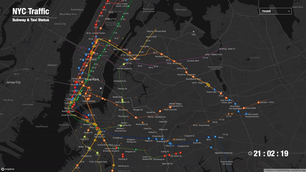
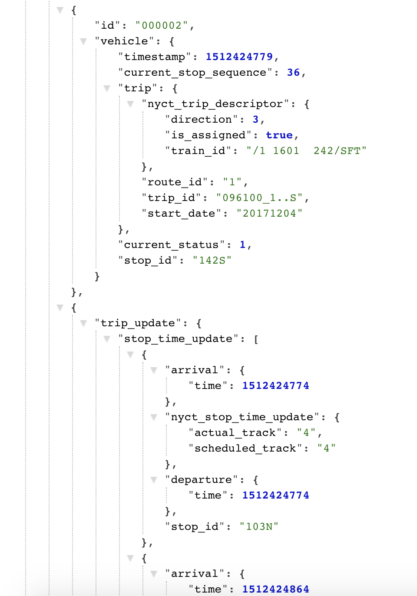

# The Data Visualization of NYC Traffic
A Javascript (p5.js) project visualizes NYC Subway and Taxi data.

	

## Data Source
### Taxi Data
Due to the difficulties of getting realtime traffic data, we found an example from [Deck.gl](https://uber.github.io/deck.gl/#/examples/custom-layers/trip-routes) , which is a visual library made by Uber. One of the example recorded the route coordinates of the taxi in a certain time span. Accordingly, we took the data from the example to be our traffic data to represent the traffic speed.
* The data is in _trips.json_

### Subway Data
For the subway data, MTA provides realtime position data for all the trains. Unfortunately, it is not in JSON format. It is in a data format called GTFS instead. GTFS stands for_General Transit Feed Specification_, which is made by Google. It uses with protocol buffer to encode the data feed into a form that is even lighter than JSON format. We found a Python solution from [GTFS Realtime Downloader](https://github.com/harrytruong/gtfs_realtime_json) that can decode the GTFS file into JSON format.

* The train position data is in the folder _20171204_2100_
* Subway station position data is in _Station.csv_
* Subway routes for every line is in _shapes.txt_ and _stops.txt_

## Implementation
### SETUP
The first thing is to set the map. Our project uses Mapbox as the base, and we use [Mappa.js](https://mappa.js.org/) to call Mapbox and connect it to p5. 
Next, load data for traffic, subway stations, subway routes, and subway GTFS data.

### DATA ANALYSIS
* To convert the raw data into class objects, I use some simple **regular expression** techniques to get and match what I want.
* To find out the information from GTFS data, I create several **hash tables** to look up train id and route id.
* Sort and trim the train data to make sure the chronological issues. 
* Sort and trim the route data to not drawing similar lines.
* Calculate the moving speed of trains and taxis in each frame.
